  

---

## 🙋‍♂️ About Me

I'm a passionate developer who loves crafting clean code and turning ideas into reality.  
I thrive on solving challenging problems and contributing to the open‑source community.

🌐 **Portfolio:** [noqokhxnh.online](https://noqokhxnh.online)

### 🎯 Current Focus
- 🚀 **Building scalable applications** – from backend architecture to delightful user interfaces  
- 🤝 **Contributing to meaningful open-source projects** – because great software is built together  
- 📚 **Learning cutting-edge technologies** – always curious about what's next  
- 👨‍🏫 **Mentoring fellow developers** – sharing knowledge lifts everyone up

---

## 🧰 Tech Stack

### 🗣️ Languages

### ⚙️ Tools & Platforms

---

## 📊 GitHub Statistics

---

  

    “Mày phải đợi thời gian mới biết được ai đúng, ai sai”
  

  

    “Còn việc tao làm, là vẽ ra trước tương lai”
  

---

  
    

