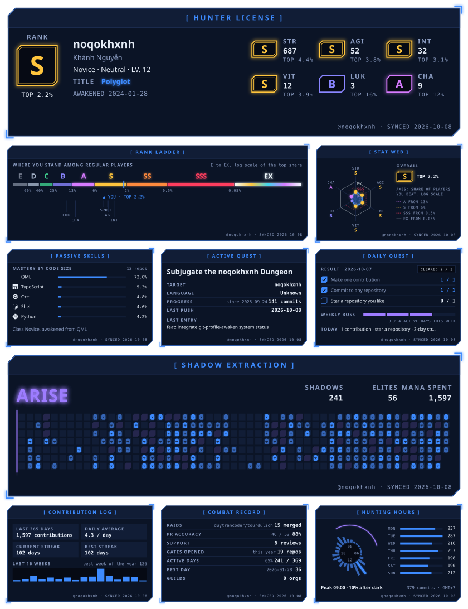

  

## System Status

<!-- AWAKEN:START -->
<!-- Generated by git-profile-awaken. Edit awaken.json instead of this block. -->

<picture><source media="(prefers-color-scheme: dark)" srcset="awaken/bento-dark.svg"><source media="(prefers-color-scheme: light)" srcset="awaken/bento-light.svg"></picture>

<!-- AWAKEN:END -->

---

  
    

